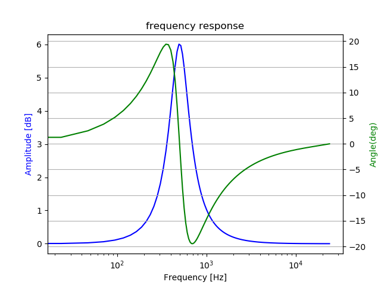
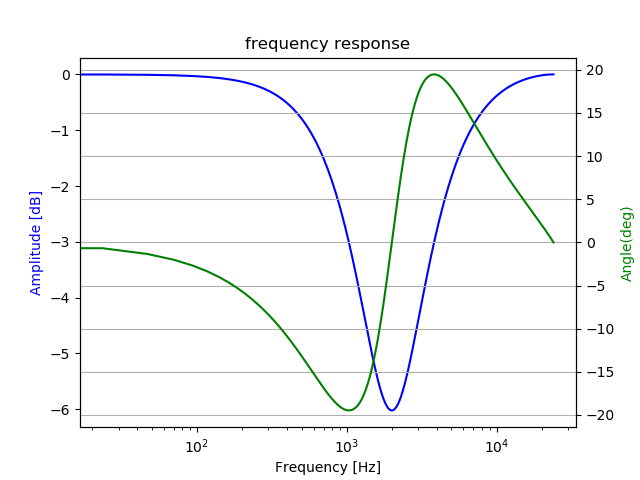

# Peaking Filter    

A python class of iir peaking filter   

## frequency response      

```
python3 iir_peaking1.py   
```
shows an example of boost peak  
  
  
and shows an example of drop peak  
  


